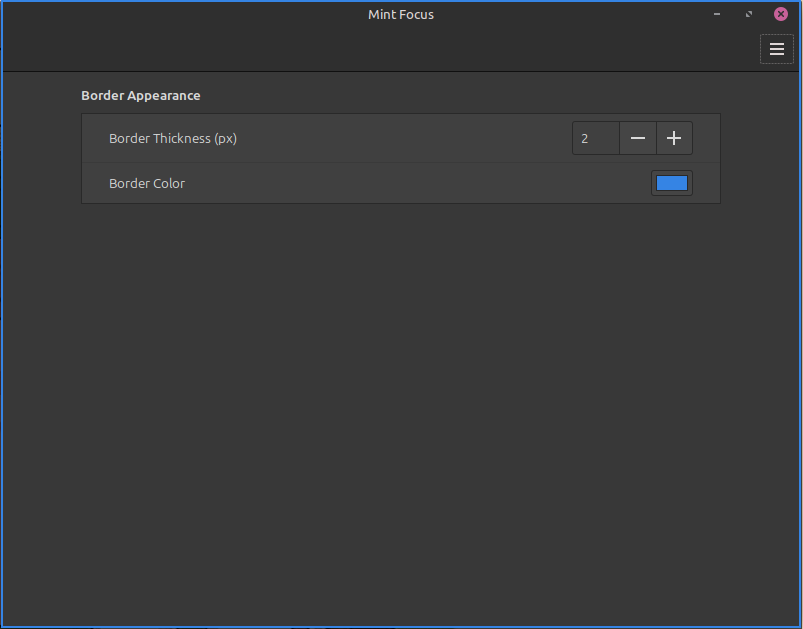

#  Mint Focus

 **Mint Focus** is a Cinnamon desktop extension that draws a thin, compositor-level outline around the currently active window, making it easy to identify which window has focus at a glance.



## Features
- **Visual Clarity**: Automatically highlights the focused window with a customizable border.
- **Dynamic Updates**: Smoothly follows window movement and resizing.
- **Customizable**: Change border width and color directly from the extension settings.
- **Lightweight**: Built using Clutter and St for minimal system impact.

## Installation
### Manual Installation
1. Download the repository as a ZIP or clone it.
2. Rename the folder to `mint-focus` if it isn't already.
3. Copy the `mint-focus` folder to `~/.local/share/cinnamon/extensions/`.
4. Open **System Settings** -> **Extensions**.
5. Find **Mint Focus** and click the **(+)** button to enable it.

### Quick Terminal Install
```bash
mkdir -p ~/.local/share/cinnamon/extensions/
git clone git@github.com:FreyaNile/mint-focus.git ~/.local/share/cinnamon/extensions/mint-focus
```
*Note: After cloning, you still need to enable it in the System Settings.*

## Configuration
You can customize the appearance via the extension settings:
- **Border Width**: Adjust the thickness of the highlight.
- **Border Color**: Change the color to match your desktop theme.

## Compatibility
Supported Cinnamon versions: 6.6.

## Repository
[https://github.com/FreyaNile/mint-focus](https://github.com/FreyaNile/mint-focus)

